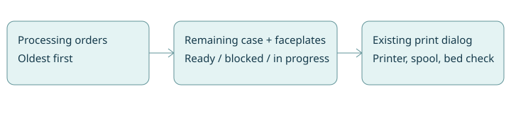

<!-- order-print-queue-20261008 -->
# Queue required order prints

The current live Queue is a manually entered `jobs` list (`src/main.tsx`); adding an entry does not drive the actual order print workflow. Replace the live surface with remaining cases and faceplates derived from the existing order plans, sorted oldest first. User clarified this scope after asking to wire up Add to queue; proceed now within the existing scoped implementation/deployment authorization.

## Success criteria
- Processing orders needing prints populate Queue without manual entry; completed, assembled, cancelled and held orders do not. Verify server tests.
- Missing sliced plates and unresolvable requirements remain visible; work already printing/awaiting an answer cannot be started again from Queue. Verify server tests and fixture browser flow.
- Print opens the existing order dialog, preserving colorway, best-printer choice and bed confirmation. No physical prints in verification.
- Overview shows an abbreviated oldest-first queue; Queue shows all; the header opens Queue instead of an unrelated manual form. Verify responsive screenshots.

## Tasks
- [x] Q1 Derive queue from order plans and pending/watched print reservations; unit tests.
- [x] Q2 Render live queue and reuse existing print dialog; preserve legacy demo jobs and all stored data.
- [x] Q3 Build, server/browser tests, rendered desktop/mobile check, scoped deploy and commit/push. No real prints or camera screenshots in public Git.

Deliverables: code and plan committed/pushed, app built/deployed, local screenshots inspected. Existing printers, orders, completion counts, sliced coverage, automatic-print policy, bed checks and notifications are preserved. No AI integration, inventory, manual-priority controls or data migration. Rollback: restore previous source/container build; data is unchanged.

Work preparation: confirmed scope from user; linear execution (shared small flow, one executor), GPT-6 with runtime-selected effort (no explicit effort exposed). Readiness: R1-R13 pass, local plan plus tracked issue; now authorized by current action request. No blocking decisions. TypeSafe skill read: exact rules/lookup stay in code. Validation: `npm run build`, `node --test server/*.test.mjs`, `npm test`; live `/queue` and Overview; safe mocked print request; screenshots excluded from Git.

Issue: https://github.com/shelbyklein/spoolside/issues/12

Completion evidence: build passed; 62 server tests and 16 browser tests passed. Fixture Queue opens the existing print dialog, selects matching TPU and requires bed confirmation. Duplicate pending sends rejected with 409. Desktop/mobile screenshots inspected; mobile spacing adjusted. Deployed to Beelink, health endpoint healthy, authenticated public Queue verified at 428×926: 15 remaining groups, 4 blocked. No physical print started. Legacy jobs retained. Screenshots excluded from public Git. Issue remains open for user acceptance.
