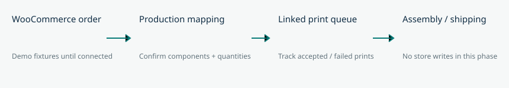

<!-- playcase-orders-workflow-2026-10-05 -->
# PlayCase orders workflow

Spoolside has a verified demo printer PWA but no order interface. Add a demo PlayCase order workspace that links order line items to component print jobs and tracks production independently from WooCommerce commercial status. User confirmed WooCommerce at playcase.gg and requested continuation; live access depends on hosting/authentication and server credentials still pending.

Current screenshots: ../handoff/spoolside-desktop.png and ../handoff/spoolside-mobile.png. Target workflow: . Orders screen uses existing navy navigation, searchable order rows, expandable inline detail with print jobs and fulfillment actions. Preserve existing printer/queue/inventory flows and artwork.

## Tasks
- [x] O1 Add demo order model, search/filter and inline details with explicit simulated provenance.
- [x] O2 Link confirmed component recipes to queued jobs; completion/reprint lifecycle and cancellation guard; persist demo production state.
- [x] O3 Verify reload persistence, duplicate queue prevention, failed print/reprint, fulfillment guards and cancellation; inspect desktop/mobile renders.

Success: order items retain identity/quantity; only mapped orders enter queue; linked jobs remain traceable; failed work cannot advance to assembly; fulfillment requires accepted prints and explicit assembly/packing checks. Source order status remains independent. No customer data, API keys, live order access or real store writes.

Deliverables: tested local source and screenshots, committed and pushed. Mode linear, single session executor; exact runtime variant/effort not exposed. Existing model metadata limitation retained. No agent dispatch for implementation; skill-required finish review runs independently.

Rollback: additive demo localStorage key, existing job key extended compatibly with optional fields. Revert commit to remove Orders UI; reset clears only demo data. Preserve existing queue jobs.

Validation: npm run build; npm test; Playwright order-to-job workflow on preview localhost 4173 at 1440px and 390px; offline remains demo-only. Order fixtures are illustrative and not an assertion of PlayCase catalog/SKUs or real customers.

Work preparation: scope authorized by continuation; hosting question pending only for live service work, independent demo workflow proceeds. Local plan is tracking authority until linked GitHub issue. R1-R8/R10-R13 pass or scope-n/a; R9 limitation retained from initial user-delegated execution. Readiness: demo workflow ready; live activation not ready.

Tracking: https://github.com/shelbyklein/spoolside/issues/2
Validation: npm run build and all 5 Playwright tests passed. Desktop/mobile Orders captures inspected. Live hosting/authentication/WooCommerce credentials remain pending; sample workflow is implemented.
